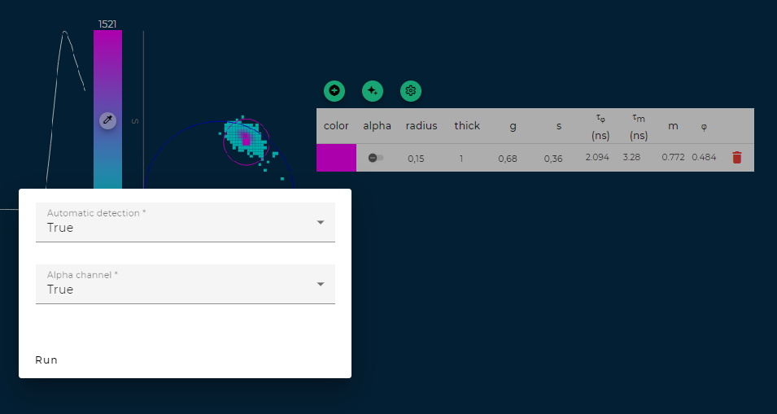

<!-- PROJECT LOGO -->
 

  

<!-- TABLE OF CONTENTS -->

  
Table of Contents

  <ol>
    <li>
      <a href="#about-the-project">About The Project</a>
    </li>
    <li>
      <a href="#getting-started">Getting Started</a>
      <ul>
        <li><a href="#prerequisites">Prerequisites</a></li>
        <li><a href="#installation">Installation</a></li>
      </ul>
    </li>
    <li>
      <a href="#home-section">Home section</a>
      <ul>
        <li>
           <a href="#load-a-saved-experiment">Load a saved experiment</a>
        </li>
         <li>
           <a href="#load-a-saved-configuration">Load a saved configuration</a>
        </li>
         <!-- <li>
           <a href="#manage-settings">Manage settings</a>
        </li> -->
         <li>
           <a href="#start-an-experiment">Start an experiment</a>
        </li>
      </ul>
    </li>
    <li>
      <a href="#start-an-experiment">Start an experiment</a>
      <ul>
        <li>
           <a href="#configure-an-experiment">Configure an experiment</a>      
        </li>
         <li>
            <a href="#wizard-mode">Wizard mode</a>
         </li>
         <li>
             <a href="#advanced-mode">Advanced mode</a>
         </li>
         <li>
            <a href="#experiment-settings">Experiment settings</a>
         </li>
      </ul>
    </li>
    <li>
      <a href="#imaging-reconstruction-experiment">Imaging Reconstruction experiment</a>
      <ul>
      <li>
           <a href="#acquisition-mode">Acquisition mode</a>        
        </li>
        <li>
           <a href="#view-mode">View mode</a>        
        </li>
        <li>
           <a href="#scouting-feature">Scouting feature</a>        
        </li>
         <li>
            <a href="#reference-feature">Reference feature</a>
        </li>
         <li >
           <a href="#data-feature">Data feature</a>
        </li>
         <li >
           <a href="#data-analysis">Data analysis</a>          
          <ul>
            <li>
            <a href="#reconstructed-image-section-1">Reconstructed image section</a>            
            </li>
             <li>
            <a href="#tcspc-istogramm-2">TCSPC istogramm</a>            
            </li>
            <li>
            <a href="#gmm--ai">GMM & AI</a>            
            </li>
            <li>
            <a href="#manual-cluster-identification">Manual cluster identification</a>            
            </li>
            <li>
            <a href="#automatic-gmm-cluster-identification">Automatic GMM cluster identification</a>            
            </li>
             <li>
            <a href="#non-automatic-gmm-cluster-identification">Non automatic GMM cluster identification </a>            
            </li>
            <li>
            <a href="#settings">Settings</a>            
            </li>
            <li>
            <a href="#save-experimentconfiguration">Save experiment/configuration</a>            
            </li>
          </ul>
        </li>
      </ul>
    </li>
    <li >
       <a href="#contacts">Contacts</a>
    </li>
  </ol>

<!-- ABOUT THE PROJECT -->
## About The Project

Welcome to [FLIM LABS STUDIO](https://www.flimlabs.com/flim-studio-software/), a versatile software designed to streamline the process of acquiring, reconstructing, and analyzing data from fluorescence lifetime imaging experiments.
This platform offers an accessible and straightforward user interface, along with intuitive tools suitable for users of all levels.

### Key features

* Real time imaging and fluorescence decay histogram data reconstruction
* Real time FLIM phasor-plot analysis (FLIM PHASORS)
* AI-driven phasor-plot analysis techniques (GMM)
* Double software configuration mode (Wizard, Advanced)
* Software calibration guided process (Scouting, Refrence, Data)
* Software API for data acquisition and reconstruction (Python)
* Supported platform: Windows

(<a href="#readme-top">back to top</a>)

<!-- GETTING STARTED -->
## Getting Started
You can download our software latest version at this [link](https://www.flimlabs.com/setup/flimlabsstudio-installer-1.0.b6.exe). Otherwise check our changelog for different versions at this [link](https://github.com/Federico-O-5bits/flimlabs.github.io/blob/main/products/flim-studio/changelog.md).

### Prerequisites
* Possess a [FLIM LABS acquisition card](https://www.flimlabs.com/products/data-acquisition-card/) to be able to acquire your data
* Windows OS

### Installation

Once the download is completed follow these steps to install FLIM STUDIO on your pc:

* Double click on the FLIM STUDIO installer, the installation process will start.
* Enter the serial number you have been provided, then click the "Next>" button.
* Read the license agreement, click the "I Agree" button in order to proceed with the installation process.
* Chose the installation folder or leave the default value. Then click the "Install" button.
* Once the installation is completed click the "Close" button.
* Now FLIM STUDIO is ready to run on your PC.

  
  
(<a href="#readme-top">back to top</a>)

<!-- HOME SECTION -->  
## Home section

The initial screen you'll encounter upon launching FLIM STUDIO is the home section.
 

    

 

Here you can perform several actions:

* ### Load a saved experiment 
The "Last experiment saved" section shows a list of saved experiments, for each of them you can read the name on the top of the figure and the data at the bottom.  
Click on a saved experiment to load it in FLIM STUDIO  
Click the reload button to refresh the list.

* ### Load a saved configuration  
The "Last configuration used" section shows a list of the previous configurations saved, for each configuration you can read the name on the top of the figure and the data at the bottom.  
Click on a saved configuration to load it in FLIM STUDIO.  
Click the reload button to refresh the list.  

<!-- * ### Manage settings 
Lorem ipsum dolor sit amet, consectetur adipiscing elit. Fusce non neque efficitur, lobortis neque facilisis, tempus est. Quisque dui arcu, hendrerit sit amet placerat id, tincidunt ac sapien. In interdum mi mi, vitae posuere nisl consectetur eget. Duis aliquet elit sit amet lacus malesuada lobortis. Ut gravida mauris ac quam egestas elementum. Curabitur vitae justo bibendum, vestibulum nibh vitae, auctor leo. -->

* ### Start an experiment  
Click the "Start" button to begin an experiment, the menu will require you to select the modality through execute it (Wizard, Advanced, From Local Folder).  
*Check the sections below for detailed information about each modality*

(<a href="#readme-top">back to top</a>)

## Start an experiment

### Configure an experiment
The first step to start an experiment is the configuration.  
FLIM STUDIO provides two configuration modalities, **WIZARD MODE** and **ADVANCED MODE**.

### Wizard mode
 

    

 
In this mode, a graphical representation of the settings being configured is provided, along with a step-by-step process.  
This allows the user to benefit from a guided and simplified experience, optimizing the setup process.

### Advanced mode 
 

    

 
The advanced mode bring a comprehensive range of customization options and provides the ability to fine-tune and set additional parameters, offering an expanded suite of options in a single view.

(<a href="#readme-top">back to top</a>)

### Experiment settings

This table outlines the necessary configurations for both Wizard and Advanced modes.

| Field name           | Value type         | Wizard mode | Advanced mode | Mandatory | Imaging | Spectroscopy |
|----------------------|--------------------|:-----------:|:-------------:|:---------:|:-------:|:------------:|
| Device               | Flim data acquisition card name.  (Detected automatically) | ✅ | ✅ | ✅ | ✅ | ✅ |
| Type of experiments  | Imaging \| Spectroscopy | ✅ | ✅ | ✅ | ✅ | ✅ |
| Sync in              | USB \| SMA         | ✅ | ✅ | ✅ | ✅ | ✅ |
| Sync out             | USB \| SMA         | ✅ | ✅ | ❌ | ✅ | ✅ |
| Channel (from 1 to 8)| USB \| SMA         | ✅ | ✅ | ✅ | ✅ | ✅ |
| Reconstruction mode  | Pixel,Line & Frame \| Line & Frame \| Pixel | ✅ | ✅ | ✅ | ✅ | ❌ |
| Pixel                | USB \| SMA         | ✅ | ✅ | ❌ | ✅ | ❌ |
| Line                 | USB \| SMA         | ✅ | ✅ | ❌ | ✅ | ❌ |
| Frame                | USB \| SMA         | ✅ | ✅ | ✅ | ✅ | ❌ |
| Pixel dwell time     | number(μs)         | ✅ | ✅ | ✅ | ✅ | ✅ |
| Pixel size           | number(μm)         | ✅ | ✅ | ✅ | ✅ | ✅ |
| Harmonic content     | number             | ❌ | ✅ | ✅ | ✅ | ✅ |
| Box width/height     | pixels (px)        | ✅ | ✅ | ✅ | ✅ | ✅ |
| Number of pixel on x/y line     | pixels (px)        | ✅ | ✅ | ✅ | ✅ | ✅ |
| Offset left/right/top/bottom     | pixels (px)        | ✅ | ✅ | ❌ | ✅ | ✅ |

(<a href="#readme-top">back to top</a>)

This table offers a detailed breakdown of the significance of each field.

| Field name          | Explanation                                                                                   |
|---------------------|-----------------------------------------------------------------------------------------------|
| Device              | FLIM STUDIO require a FLIM DATA ACQUISITION CARD to connect in order to execute the experiment, select the DATA ACQUISITION CARD connected to your pc |
| Type of experiments | Choose the type of experiment to perform:    **Imaging**: Image reconstruction transforms raw data into visual representations. It uses a scanning system, including mirrors and a lens, to precisely move a laser beam over a sample, pixel by pixel. Alternatively, a motorized stage can move the sample instead.  This precise control is crucial for collecting accurate spatial information.    **Spectroscopy**: Fluorescence Correlation Spectroscopy (FCS) studies molecular dynamics by analyzing fluorescence fluctuations. It observes fluorescent molecules diffusing in and out of a specific volume, identifying individual molecular properties.  The technique involves statistically analyzing time-dependent intensity F(t) to understand the amplitude and frequency of these fluctuations. FCS calculates the correlation between F(t) and F(t+τ) over various delay times τ, yielding an autocorrelation function G(τ) that reveals details about the fluorescent molecules.                                                      |
| Sync in              | The Sync In port is responsible for accepting the input signal from the laser. Specify whether you will use a USB cable or SMA to connect to the Sync In port. |
| Sync out             | The Sync out port is responsible for activating and modulating a laser source. Specify whether you will use a USB cable or SMA to connect to the Sync out port. |
| Channel (from 1 to 8)| Indicate the number of channels to be utilized for fluorescence sampling and choose the connection method – either USB cable or SMA – for that channel. |
| Reconstruction mode   | Specify wich spatial coordinates will be provided for the data acquisition.  Image reconstruction involves the use of three fundamental spatial coordinates: Pixel clock, Line clock, and Frame clock. Each of these coordinates plays a crucial role in accurately mapping the spatial information necessary for reconstructing a detailed and coherent image from the collected data.    FLIM STUDIO allows for conducting experiments with excellent results even when not all three spatial coordinates are available. The experiment can be carried out even in the presence of only the line clock and frame clock coordinates, or just the frame clock coordinate alone. |
| Pixel                 | Specify whether you will connect to this port via SMA or USB cable (refer to port ref3).   This port is intended to receive data regarding the spatial coordinate Pixel clock.   The spatial coordinate Pixel clock dictate the laser exposure time of each pixel (dwell time). |
| Line                  | Specify whether you will connect to this port via SMA or USB cable (refer to port ref3).   This port is intended to receive data regarding the spatial coordinate Line clock.   Govern the readout speed of each pixel row (refer to port ref2). Specify whether you will connect to this port via SMA or USB cable. |
| Frame                 | Specify whether you will connect to this port via SMA or USB cable (refer to port ref3).   This port is intended to receive data regarding the spatial coordinate Frame clock.   Regulate the acquisition rate of the entire image (frame rate) (refer to port ref3).|
| Pixel dwell time      | Define the exposure duration for each pixel to the scanner in microseconds. |
| Pixel size            | Specify the size of each pixel in micrometers. |
| Harmonic content      | Setting the harmonic content value will enable you to find the right balance between resolution and accuracy in your measurements.  By increasing the Harmonic content value, you can enhance the resolution of your experiments, measuring even the shortest fluorescence lifetimes.  This field is configured during the Reference phase, and the value set at this stage will serve as a constant reference throughout the Scouting and Data phases, remaining unchanged. |
| Box width/height      | Specify the width/height of the frame to scan. |
| Number of pixel on x/y line        | Set the same value as made in Box width/Box height. |
| Offset left/right/top/bottom       | Specify the offset from the edges of the box from which to extract the images.   In both wizard and advanced mode, check the helpfull visual representation at the bottom of the section. |

(<a href="#readme-top">back to top</a>)

## IMAGING RECONSTRUCTION EXPERIMENT
This section deals with more in-depth description of the imaging reconstruction experiment.
 

    

 

The imaging reconstruction experiment section provides two operational modes ([**ACQUISITION MODE**](#acquisition-mode), [**VIEW MODE**](#view-mode)) and three different features divided by tabs ([**REFERENCE FEATURE**](#reference-feature), [**SCOUTING FEATURE**](#scouting-feature), [**DATA FEATURE**](#data-feature)), allowing a systematic approach to fine-tune experiments.

### ACQUISITION MODE
After [configuring the experiment](#configure-an-experiment), this mode is activated for acquiring new experimental data.  
You can use the **SCOUTING FEATURE**, **REFERENCE FEATURE** and **DATA FEATURE** to  successfully complete the experiment.

### VIEW MODE
To activate this mode, click on a saved experiment under the [Load a saved experiment](#load-a-saved-experiment) voice in the [Home section](#home-section).  
The Image Reconstruction Experiment section will display all the data from your saved experiment.  
Here, you can navigate through the **REFERENCE FEATURE** and **DATA FEATURE** tabs to view the saved data. However, acquiring new data is not possible in this mode.  
To analyze the data from the saved experiment, refer to the Data Analysis section for guidance on how to proceed.

(<a href="#readme-top">back to top</a>)

### SCOUTING FEATURE
 This feature is available only in the [Acquisition mode](#acquisition-mode), it allows you to explore your sample by acquiring images, enabling you to navigate through it to find your region of interest (ROI).

 You can use this feature before and after the software calibration.  

 Follow these step to use the **SCOUTING FEATURE** and calibrate the software:
 * Click to the **SCOUTING** tab placed in the upper-left side of the view.
 * Navigate to the upper-right corner of the interface and specify the number of frames to be captured (ex. 10) in the "Number of frame" input field.
 * Begin the acquisition process by clicking the start icon, located at the top right of the interface.

 The data acquisition will begin and subsequently cease upon reaching the designated number of frames.

(<a href="#readme-top">back to top</a>)

### REFERENCE FEATURE

After completing the [experiment configuration](#experiment-configuration), the next step is the software calibration
(*the scouting feature is optional*).

Follow these step to use the **REFERENCE FEATURE** and calibrate the software:
* Click to the **REFERENCE** tab placed in the upper-left side of the view.
* Place a sample with a known fluorescence lifetime on your microscope.  (ex. fluorescein, decay time: 3.6ms)
* Navigate to the upper-right corner of the interface and set the decay time in the "Decay time" input field. 
* In the same upper-right section, specify the number of frames to be captured (ex. 10) in the "Number of frame" input field.
* Begin the acquisition process by clicking the start icon, located at the top right of the interface.

The software will commence data acquisition, utilizing the predefined decay time for self-calibration. Data acquisition will automatically cease upon reaching the designated number of frames.  
Note that this calibration process is a one-time requirement and is not necessary for future data acquisitions as long as you remain in the same experiment configuration session.

After successful calibration, you are ready to proceed with the [data acquisition](#data-feature)

**When navigating in the REFERENCE FEATURE tab while in VIEW MODE, it is not possible to initiate a new reference process. This mode only permits viewing the data from the last reference process that was run.**

(<a href="#readme-top">back to top</a>)

### DATA FEATURE

After completing the [software calibration](#reference-feature), the next step is the data acquisition.  
Here is where effectively commence the imaging experiment by acquiring data from your sample (*replace the calibration phase sample with the sample that you want to analyze*).  

Follow these step to use the **DATA FEATURE**:
*VNavigate to the **DATA** tab placed at the upper-left side of the interface.
*Navigate to the upper-right corner of the interface and set the number of frames to be captured (ex. 20) in the "Number of frame".
* Begin the acquisition process by clicking the start icon, located at the top right of the interface.  

The software will commence data acquisition and automatically cease upon reaching the designated number of frames.
When the acquisition is completed you can begin the [data analysis](#data-analysis).

**When navigating in the DATA FEATURE tab while in View mode, it is not possible to initiate a new data acquisition process. This mode only permits viewing the data from the last data acquisition process that was run.**

(<a href="#readme-top">back to top</a>)

### DATA ANALYSIS

After completing data acquisition (Acuisition mode), or upon loading a saved experiment (View mode) you can start analyzing the experiment records using the data visualization tools provided by FLIM STUDIO. (**Reconstructed image section [1]**, **TCSPC ISTOGRAMM [2]**, **Phasor plot and GMM (AI) [3]**)
 

    

 

#### RECONSTRUCTED IMAGE SECTION [1]

The section consists of four elements, listed from left to right:

1. **Photon Number Filter**: By vertically moving the two sliders, you can filter the image areas to display based on the minimum and maximum number of photons.
2. **Color Map Selector**: Clicking on the colored bar opens a selection menu where you can choose your preferred color map. The selected color map will be applied to the adjacent reconstructed image.
3. **Sample Image**: This displays the image reconstructed by the microscope, capturing photons emitted from the sample after excitation by the laser beam. The image enables visualization of the photon emission intensity in various areas of the sample.
4. **Toolbar**: From the top, you can use the following features:
      * **Magnify**: Transforms the mouse cursor into a magnifying glass. Select the magnification value and move the cursor over the reconstructed image to explore it.
      * **Zoom**: After selecting the zoom value, an enlarged version of the reconstructed image will be displayed.
      * **Unlock**: By clicking on a point of the reconstructed image, you can view its corresponding representation on the TCSPC HISTOGRAM[2]. To click on another point of the image, unlock the cursor by clicking on 'unlock'.
      * **Rectangle**: Analyzes a specific part of the image by selecting a rectangular area.
      * **Circle**: Analyzes a specific part of the image by selecting a circular area.
      * **Polyline**: Analyzes a specific part of the image by using a polyline to select the area.
      * **Export**: Exports the experimental data, specifying the format (Matlab, HDF, Python, SVG).
      
(<a href="#readme-top">back to top</a>)

#### TCSPC ISTOGRAMM [2]      
In this section a fluorescence intensity decay profile Istogramm is represented.  
The x-axis of the TCSPC histogram represents the time intervals following a laser pulse used to excite the sample. Each interval correlates with a certain delay after the excitation pulse, and it is within these slices of time that the photon counts are recorded.  
On the y-axis, you will find the number of photon events detected, which effectively measures the intensity of fluorescence at each time interval.  
The data plotted in the histogram spans across the period of the laser pulse. This means that the photon detection is synchronized with the periodicity of the laser.  
From the negative exponential curve of the histogram, you can deduce the fluorescence lifetime of the sample. 
By default the Istogramm represents the cumulative of each point in the sample, so the represented curve will be linear.  
 

    

 

Otherwise moving the cursor over a specific point of the RECONSTRUCTED IMAGE[1] the graphic will show the acquired data for that specific part, resulting in a jagged line.
 

    

 

(<a href="#readme-top">back to top</a>)

#### PHASOR PLOT [3]
 

    

 

The phasor plot allows a graphical representation of the lifetime distribution enabling to separate different lifetime populations within the same sample.  
In the phasor plot different lifetime values (a cloud of points) are distributed over a semicircle where the “longest” lifetime are on the left side, while the “shortest” ones on the right side of the plot.  
 If the cloud of points falls precisely on the semicircle, it means that the fluorescence signal can be described by a single exponential decay, while if the cloud falls within the semicircle area, the lifetime is a superposition of different values.

Click on the bar at the left of the phasor plot to select your preferred color map.
The selected color map will be applied to the cloud of point in the graphic.

(<a href="#readme-top">back to top</a>)

#### GMM & AI
 

    

 

Fluorescence lifetime profiles typically consist of various lifetimes stemming from multiple fluorophores. The combination of Gaussian Mixture Models (GMM) and clustering methods facilitates the separation of these complex distributions, enabling you to identify and classify unique populations of fluorescence lifetimes present in a specimen.

(<a href="#readme-top">back to top</a>)

##### MANUAL CLUSTER IDENTIFICATION
To manually specify clusters on the phasor plot, click the green '+' button then move your cursor over the phasor plot and place the cluster in the region of your choiche. Multiple clusters can be added to the phasor plot.    
You can relocate a cluster by clicking its center and dragging it to a new position, then clicking again to set it.  
Below the green '+' button is a table displaying cluster information:  
* **Color**: Click on the color box to change the cluster's color (the selected color will be reflected also on the [sample reconstructed image](#reconstructed-image-section-1)).
* **Alpha**: Toggle the alpha channel to introduce transparency, aiding in the distinction of overlapping clusters (the activation of the alpha cannel will be reflected on the sample reconstructed image).
* **Radius**: Adjust the cluster's radius here.
* **Thick**: Change the thickness of the cluster's outline (for visual representation only).
* **g**: Modify the cluster's position on the g-axis either by using specific buttons or by dragging the cluster on the phasor plot.
* **s**: Alter the cluster's position on the s-axis similarly.
* **τφ** (Phase lifetime): This parameter, derived from frequency-domain fluorescence lifetime measurements, is based on the phase shift between modulated excitation light and emitted fluorescence.
* **τm** (Modulation lifetime): Represents the modulation lifetime, also from frequency-domain measurements. It is calculated from the demodulation of the fluorescence signal relative to the excitation light. Identical τm and τφ values suggest a single exponential component in fluorescence decay, indicating a uniform lifetime throughout the sample.
* **φ**: Represents the phase shift between the excitation light and the emitted fluorescence. It's a measure of how much the emission lags behind the oscillating excitation source in frequency-domain fluorometry. The phase shift is related to the fluorescence lifetime; a larger phase shift generally indicates a longer fluorescence lifetime.
* **m**: Stands for the modulation depth or the demodulation factor of the fluorescence signal. In modulated excitation experiments, both the excitation light and the emitted fluorescence are modulated. However, due to the finite lifetime of the excited state, the fluorescence emission will be demodulated relative to the excitation. The degree of this demodulation is related to the lifetime of the fluorescence emission; a more significant reduction in modulation depth indicates a longer fluorescence lifetime.
* **Bin icon**: Click the bin icon to delete the cluster.

(<a href="#readme-top">back to top</a>)

#####  AUTOMATIC GMM CLUSTER IDENTIFICATION
 

    

  

The Gaussian Mixture Model (GMM) is a probabilistic approach that interprets a dataset as a blend of several Gaussian distributions.  
In GMM, each Gaussian element is a distinct cluster or subgroup within the overall data.  
This model is particularly adept at handling scenarios where data points might be associated with more than one cluster, offering a nuanced view of data variability.

FLIM Studio's  machine learning AI identifies clusters on your phasor plot. It assigns distinct, vibrant colors to each cluster for enhanced visual distinction.

To enable automatic GMM cluster detection follow these steps:  
* Click the second green circular button from the left
* Set the 'Automatic detection' input field to 'True'
* Specify whether to use the alpha channel on the 'Alpha channel' input field
* Click the 'Run' button to initiate the automatic identification of GMM clusters.

(<a href="#readme-top">back to top</a>)

##### NON AUTOMATIC GMM CLUSTER IDENTIFICATION
 

    

 

Manually specify the number of clusters to be identified to use the potential of GMM without taking advantage of automatic detection via AI.
To run the non automatic gmm cluster identification follow these steps:
* Click the second green button from the left
* Set the 'Automatic detection' input field to 'False'
* Set the number of cluster to identify
* Specify whether to use the alpha channel on the 'Alpha channel' input field
* Click the 'Run' button to initiate the cluster identification process.

(<a href="#readme-top">back to top</a>)

##### SETTINGS
Click the third green circular button from the left to open the settings select.
Here you can:
* Modify the phasor plot image bins: Click on 'Bins' and select the desired number of pixels
* Check the Harmonic value: The value is not editable and setted during the experiment configuration.

##### SAVE EXPERIMENT/CONFIGURATION
Click on the save icon placed at the top-right corner of the view to save the experiment or the experiment configuation.
You'll be able to retrieve the saves in the Home section under the "Last experiment saved" and "Last configuration used" voices.

<!-- CONTACT -->
## Contacts

FLIM LABS: info@flimlabs.com

FLIM LABS website: [FLIM LABS](https://www.flimlabs.com/)

(<a href="#readme-top">back to top</a>)

