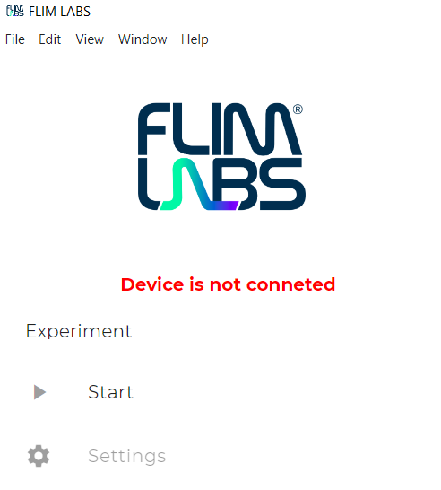
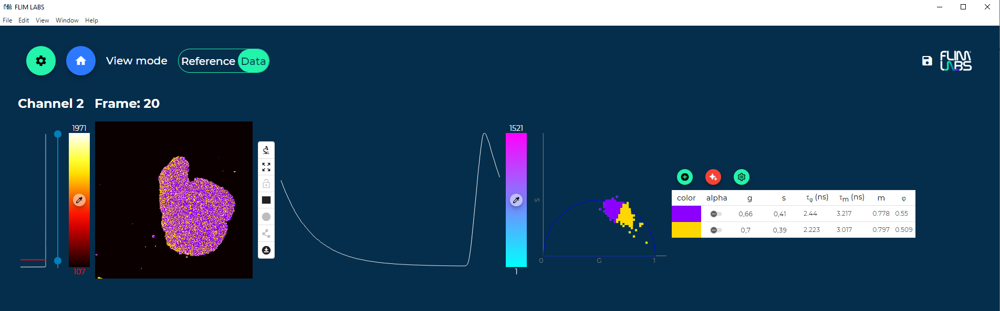

<!-- PROJECT LOGO -->
 

  

<!-- TABLE OF CONTENTS -->

  
Table of Contents

  <ol>
  <li>
      <a href="#legend">Legend</a>
    </li>
    <li>
      <a href="#about-the-project">About The Project</a>
    </li>
    <li>
      <a href="#getting-started">Getting Started</a>
      <ul>
        <li><a href="#prerequisites">Prerequisites</a></li>
        <li><a href="#installation">Installation</a></li>
      </ul>
    </li>
    <li>
      <a href="#home-section">Home section</a>
      <ul>
        <li>
           <a href="#load-a-saved-experiment">Load a saved experiment</a>
        </li>
         <li>
           <a href="#load-a-saved-configuration">Load a saved configuration</a>
        </li>
         <!-- <li>
           <a href="#manage-settings">Manage settings</a>
        </li> -->
         <li>
           <a href="#start-an-experiment">Start an experiment</a>
        </li>
      </ul>
    </li>
    <li>
      <a href="#start-an-experiment">Start an experiment</a>
      <ul>
        <li>
           <a href="#configure-an-experiment">Configure an experiment</a>      
        </li>
         <li>
            <a href="#wizard-mode">Wizard mode</a>
         </li>
         <li>
             <a href="#advanced-mode">Advanced mode</a>
         </li>
         <li>
             <a href="#from-local-folder">From local folder</a>
         </li>
         <li>
            <a href="#experiment-settings">Experiment settings</a>
         </li>
      </ul>
    </li>
    <li>
      <a href="#imaging-reconstruction-experiment">Imaging Reconstruction experiment</a>
      <ul>
      <li>
           <a href="#acquisition-mode">Acquisition mode</a>        
        </li>
        <li>
           <a href="#view-mode">View mode</a>        
        </li>
        <li>
           <a href="#scouting-feature">Scouting feature</a>        
        </li>
         <li>
            <a href="#reference-feature">Reference feature</a>
        </li>
         <li >
           <a href="#data-feature">Data feature</a>
        </li>
        <li>
           <a href="#save-experiment">Save experiment</a>            
        </li>
         <li>
           <a href="#save-configuration">Save configuration</a>            
        </li>
         <li >
           <a href="#data-analysis">Data analysis</a>          
          <ul>
            <li>
            <a href="#reconstructed-image-section-1">Reconstructed image section</a>            
            </li>
             <li>
            <a href="#tcspc-histogramm-2">TCSPC histogramm</a>            
            </li>        
            <li>
            <a href="#phasor-plot-and-flim-image">Phasor plot and FLIM image</a>            
            </li>
            <li>
            <a href="#circlet-positioning">Circlet positioning</a>            
            </li>
            <li>
            <a href="#circlet-centering">Circlet centering</a>            
            </li> 
            <li>
            <a href="#median-filter">Median filter</a>            
            </li> 
            <li>
            <a href="#phase-gradient-background">Phase gradient background</a>            
            </li> 
              <li>
            <a href="#radial-gradient-background">Radial gradient background</a>            
            </li> 
            <li>
            <a href="#applyng-a-radial-gradient-background">Entangled circlets</a>            
            </li> 
            <li>
            <a href="#settings">Settings</a>            
            </li>
            <li>
            <a href="#gaussian-mixture-model---GMM">Gaussian Mixture Model - GMM </a>            
            </li>
            <li>
            <a href="#automatic-gmm-cluster-identification">Automatic GMM cluster identification</a>            
            </li>
             <li>
            <a href="#non-automatic-gmm-cluster-identification">Non automatic GMM cluster identification </a>            
            </li>
          </ul>
        </li>
      </ul>
    </li>
    <li >
       <a href="#contacts">Contacts</a>
    </li>
  </ol>

## Legend

| Icon    | Description                                                                                                                                                                                                                                                           |
| ------- | --------------------------------------------------------------------------------------------------------------------------------------------------------------------------------------------------------------------------------------------------------------------- |
| [📖](#) | "Internal Section Link": Click this icon to navigate to specific sections within the manual. It serves as a quick reference to easily access detailed information related to the text it accompanies.                                                                 |
| [🔗](#) | "Specific Topic External Link": Click this icon to visit the specific section related to the topic on the official FLIM LABS website. It directs you to a dedicated page where you can find more detailed information about the subject matter mentioned in the text. |

<!-- ABOUT THE PROJECT -->

## About The Project

Welcome to [FLIM STUDIO](https://www.flimlabs.com/flim-studio-software/), a versatile software designed to streamline the process of acquiring, reconstructing, and analyzing data from fluorescence lifetime imaging experiments.
This platform offers an accessible and straightforward user interface, along with intuitive tools suitable for users of all levels.

### Key features

- Real time imaging and fluorescence decay histogram data reconstruction
- Real time FLIM phasor-plot analysis (FLIM Phasors: [📖](#phasor-plot-3), [🔗](https://www.flimlabs.com/flim-phasors/))
- AI-driven phasor-plot analysis techniques (GMM: [📖](#gaussian-mixture-model---GMM), [🔗](https://www.flimlabs.com/flim-gmm/))
- Double software configuration mode (Wizard: [📖](#wizard-mode), [🔗](https://www.flimlabs.com/flim-studio-software/); Advanced: [📖](#advanced-mode), [🔗](https://www.flimlabs.com/flim-studio-software/))
- Software calibration guided process (Scouting: [📖](#scouting-feature), [🔗](https://www.flimlabs.com/flim-studio-software/); Reference: [📖](#reference-feature), [🔗](https://www.flimlabs.com/flim-studio-software/); Data: [📖](#data-feature), [🔗](https://www.flimlabs.com/flim-studio-software/))
- Software API for data acquisition and reconstruction (Python: [📖](https://github.com/pontino/flim-python-examples), [🔗](#))
- Supported platform: Windows

(<a href="#readme-top">back to top</a>)

<!-- GETTING STARTED -->

## Getting Started

You can download our software latest version at this [link](https://www.flimlabs.com/setup/flimlabsstudio-installer-1.0.b6.exe). Otherwise check our changelog for different versions at this [link](https://github.com/Federico-O-5bits/flimlabs.github.io/blob/main/products/flim-studio/changelog.md).

### Prerequisites

- Possess a [FLIM LABS data acquisition card](https://www.flimlabs.com/products/data-acquisition-card/).

 
  

  
  
 

Verify whether the software detects or recognizes the card, and ensure that it returns the card's serial number.

- Windows OS

### Installation

Once the download is completed follow these steps to install FLIM STUDIO on your pc:

- Double click on the FLIM STUDIO installer, the installation process will start.
- Enter the serial number you have been provided, then click the "Next>" button.
- Read the license agreement, click the "I Agree" button in order to proceed with the installation process.
- Chose the installation folder or leave the default value. Then click the "Install" button.
- Once the installation is completed click the "Close" button.
- Now FLIM STUDIO is ready to run on your PC.

  
(<a href="#readme-top">back to top</a>)

<!-- HOME SECTION -->

## Home section

The initial screen you'll encounter upon launching FLIM STUDIO is the home section.

 

    

 

Here you can perform several actions:

- ### Load a saved experiment

  The "Last experiment saved" section shows a list of saved experiments, for each of them you can read the name on the top of the figure and the data at the bottom.  
  Click on a saved experiment to load it in FLIM STUDIO  
  Click the reload button to refresh the list.

- ### Load a saved configuration
  The "Last configuration used" section shows a list of the previous configurations saved, for each configuration you can read the name on the top of the figure and the data at the bottom.  
  Click on a saved configuration to load it in FLIM STUDIO.  
  Click the reload button to refresh the list.

<!-- * ### Manage settings
Lorem ipsum dolor sit amet, consectetur adipiscing elit. Fusce non neque efficitur, lobortis neque facilisis, tempus est. Quisque dui arcu, hendrerit sit amet placerat id, tincidunt ac sapien. In interdum mi mi, vitae posuere nisl consectetur eget. Duis aliquet elit sit amet lacus malesuada lobortis. Ut gravida mauris ac quam egestas elementum. Curabitur vitae justo bibendum, vestibulum nibh vitae, auctor leo. -->

- ### Start an experiment
  To initiate an experiment configuration, simply click on the "Start" button. The ensuing menu will prompt you to choose from three distinct modalities to configure the software: Wizard, Advanced, or From Local Folder.
    
(<a href="#readme-top">back to top</a>)

## Start an experiment

### Configure an experiment

The initial step in data acquisition involves beginning the configuration of the software for collecting data.  
FLIM STUDIO provides three configuration modalities, **Wizard mode**, **Advanced mode** and **From local folder**.

### Wizard mode

 

    

 
In this mode, a graphical representation of the settings being configured is provided, along with a step-by-step process.  
This allows the user to benefit from a guided and simplified experience, optimizing the setup process.

(<a href="#readme-top">back to top</a>)

### Advanced mode

 

    

 
The advanced mode bring a comprehensive range of customization options and provides the ability to fine-tune and set additional parameters, offering an expanded suite of options in a single view.

(<a href="#readme-top">back to top</a>)

### From local folder

In this mode, you have the capability to upload pre-configured files for immediate use. This facilitates the sharing of specific configurations with others or across different devices, enabling experiments on various devices under identical settings.

(<a href="#readme-top">back to top</a>)

### Experiment settings

<!--
This table outlines the necessary configurations for both Wizard and Advanced modes.

| Field name           | Value type         | Wizard mode | Advanced mode | Mandatory | Imaging | Spectroscopy |
|----------------------|--------------------|:-----------:|:-------------:|:---------:|:-------:|:------------:|
| Device               | Flim data acquisition card name.  (Detected automatically) | ✅ | ✅ | ✅ | ✅ | ✅ |
| Type of experiments  | Imaging \| Spectroscopy | ✅ | ✅ | ✅ | ✅ | ✅ |
| Sync in              | USB \| SMA         | ✅ | ✅ | ✅ | ✅ | ✅ |
| Sync out             | USB \| SMA         | ✅ | ✅ | ❌ | ✅ | ✅ |
| Channel (from 1 to 8)| USB \| SMA         | ✅ | ✅ | ✅ | ✅ | ✅ |
| Reconstruction mode  | Pixel,Line & Frame \| Line & Frame \| Pixel | ✅ | ✅ | ✅ | ✅ | ❌ |
| Pixel                | USB \| SMA         | ✅ | ✅ | ❌ | ✅ | ❌ |
| Line                 | USB \| SMA         | ✅ | ✅ | ❌ | ✅ | ❌ |
| Frame                | USB \| SMA         | ✅ | ✅ | ✅ | ✅ | ❌ |
| Pixel dwell time     | number(μs)         | ✅ | ✅ | ✅ | ✅ | ✅ |
| Pixel size           | number(μm)         | ✅ | ✅ | ✅ | ✅ | ✅ |
| Harmonic content     | number             | ❌ | ✅ | ✅ | ✅ | ✅ |
| Box width/height     | pixels (px)        | ✅ | ✅ | ✅ | ✅ | ✅ |
| Number of pixel on x/y line     | pixels (px)        | ✅ | ✅ | ✅ | ✅ | ✅ |
| Offset left/right/top/bottom     | pixels (px)        | ✅ | ✅ | ❌ | ✅ | ✅ |

(<a href="#readme-top">back to top</a>)
 -->

This table offers a detailed breakdown of the significance of each field.

| Field name                                                            | Explanation                                                                                                                                                                                                                                                                                                                                                                                                                                                                                                                                                                                                                                                                                                                                                                                                                     |
| --------------------------------------------------------------------- | ------------------------------------------------------------------------------------------------------------------------------------------------------------------------------------------------------------------------------------------------------------------------------------------------------------------------------------------------------------------------------------------------------------------------------------------------------------------------------------------------------------------------------------------------------------------------------------------------------------------------------------------------------------------------------------------------------------------------------------------------------------------------------------------------------------------------------- |
| Device                                                                | FLIM STUDIO require a FLIM data acquisition card to connect in order to execute the experiment, select the data acquisition card connected to your pc                                                                                                                                                                                                                                                                                                                                                                                                                                                                                                                                                                                                                                                                           |
| Type of experiments                                                   | Choose the type of experiment to perform:    **Imaging**: This method employs a scanning system, which includes mirrors and a lens, to meticulously guide a laser beam over a specimen in a pixel-by-pixel manner. As the laser excites the specimen, it emits fluorescence. A high-resolution image is then reconstructed by measuring and analyzing the time taken for this emitted fluorescence to decay.    **Spectroscopy**: This technique captures the light intensity emitted by a sample over time following excitation by a brief laser pulse. It enables the analysis of the fluorescence lifetime of molecules in the sample. The approach involves repeatedly and accurately recording individual photons from a fluorescence signal, with the time reference corresponding to the laser pulse period. |
| Sync in                                                               | The Sync In port is responsible for accepting the input signal from the laser. Specify whether you will use a USB cable or SMA to connect to the Sync In port.                                                                                                                                                                                                                                                                                                                                                                                                                                                                                                                                                                                                                                                                  |
| Sync out                                                              | The Sync out port is responsible for activating and modulating a laser source. Specify whether you will use a USB cable or SMA to connect to the Sync out port.                                                                                                                                                                                                                                                                                                                                                                                                                                                                                                                                                                                                                                                                 |
| Channel (from 1 to 8)                                                 | Indicate the number of channels to be utilized for fluorescence sampling and choose the connection method – either USB cable or SMA – for that channel.                                                                                                                                                                                                                                                                                                                                                                                                                                                                                                                                                                                                                                                                         |
| [Reconstruction mode](https://www.flimlabs.com/image-reconstruction/) | Specify wich spatial coordinates will be provided for the data acquisition.  Image reconstruction involves the use of three fundamental spatial coordinates: Pixel clock, Line clock, and Frame clock. Each of these coordinates plays a crucial role in accurately mapping the spatial information necessary for reconstructing a detailed and coherent image from the collected data.    FLIM STUDIO allows for conducting experiments with excellent results even when not all three spatial coordinates are available. The experiment can be carried out even in the presence of only the line clock and frame clock coordinates, or just the frame clock coordinate alone.                                                                                                                                        |
| Pixel                                                                 | Specify whether you will connect to this port via SMA or USB cable (refer to port ref3).   This port is intended to receive data regarding the spatial coordinate Pixel clock.   The spatial coordinate Pixel clock dictate the laser exposure time of each pixel (dwell time).                                                                                                                                                                                                                                                                                                                                                                                                                                                                                                                                           |
| Line                                                                  | Specify whether you will connect to this port via SMA or USB cable (refer to port ref3).   This port is intended to receive data regarding the spatial coordinate Line clock.   Govern the readout speed of each pixel row (refer to port ref2). Specify whether you will connect to this port via SMA or USB cable.                                                                                                                                                                                                                                                                                                                                                                                                                                                                                                   |
| Frame                                                                 | Specify whether you will connect to this port via SMA or USB cable (refer to port ref3).   This port is intended to receive data regarding the spatial coordinate Frame clock.   Regulate the acquisition rate of the entire image (frame rate) (refer to port ref3).                                                                                                                                                                                                                                                                                                                                                                                                                                                                                                                                                     |
| Pixel dwell time                                                      | Define the exposure duration for each pixel to the scanner in microseconds.                                                                                                                                                                                                                                                                                                                                                                                                                                                                                                                                                                                                                                                                                                                                                     |
| Pixel size                                                            | Specify the size of each pixel in micrometers.                                                                                                                                                                                                                                                                                                                                                                                                                                                                                                                                                                                                                                                                                                                                                                                  |
| Harmonic content                                                      | Setting the harmonic content value will enable you to find the right balance between resolution and accuracy in your measurements.  By increasing the Harmonic content value, you can enhance the resolution of your experiments, measuring even the shortest fluorescence lifetimes.  This field is configured during the Reference phase, and the value set at this stage will serve as a constant reference throughout the Scouting and Data phases, remaining unchanged.                                                                                                                                                                                                                                                                                                                                              |
| Box width/height                                                      | Specify the width/height of the frame to scan of the laser-scanned area.  However, this area does not always match the area from which data is captured. In fact, the data acquisition area is defined by setting the [Number of pixel on x/y line input](#number-of-pixel).  For a graphical representation of the difference between this field and 'Number of pixel on x/y line' check the [GIF](#box-frame-gif) in the field below.                                                                                                                                                                                                                                                                                                                                                                                   |
| Number of pixel on x/y line         | Set the same value as made in Box width/Box height.  Starting from the top-left corner of the Box choose the number of pixels along the X and Y axes from which to retrieve data.  The maximum value is determined by the value set in the 'Box Width/Height' input field.    

                                                                                                                                                                                                                                                                                                                                                                                                     |
| Offset left/right/top/bottom                                          | Specify the offset from the edges of the box from which to extract the images.  When you need to filter the acquired data, it's beneficial to discard the less accurate values, which are typically found along the edges of the box due to laser bleeding.   In both wizard and advanced mode, check the helpfull [visual representation](#box-frame-gif) at the bottom of the section.                                                                                                                                                                                                                                                                                                                                                                                                                                  |

(<a href="#readme-top">back to top</a>)

## Imaging experiment

This section deals with more in-depth description of the imaging experiment.
 

    

 

The imaging reconstruction experiment section provides two operational modes ([**Acquisition mode**](#acquisition-mode), [**View mode**](#view-mode)) and three different features divided by tabs ([**Reference tab**](#reference-tab), [**Scouting tab**](#scouting-feature), [**Data tab**](#data-tab)), allowing a systematic approach to fine-tune experiments.

### Acquisition mode

FLIM STUDIO is an asynchronous acquisition software, meaning it operates independently of the connected image acquisition system.  
This can result in FLIM STUDIO missing the first incoming frame if it starts after the image acquisition system, potentially leading to partial data capture.  
To mitigate this, **FLIM STUDIO automatically discards the first received frame,** ensuring that only fully complete frames are captured. This strategy enhances the integrity and reliability of the data collected, as it prevents the inclusion of any potentially incomplete initial frames.

After [configuring the experiment](#configure-an-experiment), this mode is activated for acquiring new experimental data.  
You can use the **Scouting tab**, **Reference tab** and **Data tab** to successfully complete the experiment.

### View mode

To activate this mode, click on a saved experiment under the [Load a saved experiment](#load-a-saved-experiment) voice in the [Home section](#home-section).  
The image reconstruction experiment section will display all the data from your saved experiment.  
Here, you can navigate through the **Reference tab** and **Data tab** tabs to view the saved data. However, acquiring new data is not possible in this mode.  
To analyze the data from the saved experiment, refer to the Data Analysis section for guidance on how to proceed.

(<a href="#readme-top">back to top</a>)

### Scouting tab

This feature is available only in the [Acquisition mode](#acquisition-mode), it allows you to explore your sample by acquiring images, enabling you to navigate through it to find your region of interest (ROI).  
 During the data acquisition process, images are presented one by one, in contrast to the **Reference tab** and **Data tab**, where they are displayed in a stacked manner.

You can use this feature before and after the software calibration.

Follow these step to use the **Scouting feature** and calibrate the software:

- Click to the **Scouting tab** placed in the upper-left side of the view.
- Navigate to the upper-right corner of the interface and specify the number of frames to be captured (ex. 10) in the "Number of frame" input field.
- Begin the acquisition process by clicking the start icon, located at the top right of the interface.

The data acquisition will begin and subsequently cease upon reaching the designated number of frames.

(<a href="#readme-top">back to top</a>)

### Reference tab

After completing the [experiment configuration](#experiment-configuration), the next step is the software calibration
(_the scouting feature is optional_).

Follow these step to use the **Reference feature** and calibrate the software:

- Click to the **Reference tab** placed in the upper-left side of the view.
- Place a sample with a known and monoexponential fluorescence lifetime value under your microscope objective. (e.g. fluorescein in water, fluorescence lifetime: 4.1 ns ).
- Navigate to the upper-right corner of the interface and set the decay time in the "Decay time" input field.
- In the same upper-right section, specify the number of frames to be captured (ex. 10) in the "Number of frame" input field.
- Begin the acquisition process by clicking the start icon, located at the top right of the interface.

The software will commence data acquisition, utilizing the predefined decay time for self-calibration. Data acquisition will automatically cease upon reaching the designated number of frames.  
Note that this calibration process is a one-time requirement and is not necessary for future data acquisitions as long as you remain in the same experiment configuration session.

After successful calibration, you are ready to proceed with the [data acquisition](#data-feature)

**When navigating in the Reference tab while in View mode, it is not possible to initiate a new reference process. This mode only permits viewing the data from the last reference process that was run.**

(<a href="#readme-top">back to top</a>)

### Data tab

After completing the [software calibration](#reference-feature), the next step is the data acquisition.  
Here is where effectively commence the imaging experiment by acquiring data from your sample (_replace the calibration phase sample with the sample that you want to analyze_).

Follow these step to use the **Data feature**:

- Navigate to the **Data tab** placed at the upper-left side of the interface.
- Navigate to the upper-right corner of the interface and set the number of frames to be captured (ex. 20) in the "Number of frame".
- Begin the acquisition process by clicking the start icon, located at the top right of the interface.

The software will commence data acquisition and automatically cease upon reaching the designated number of frames.
When the acquisition is completed you can begin the [data analysis](#data-analysis).

**When navigating in the Data tab while in View mode, it is not possible to initiate a new data acquisition process. This mode only permits viewing the data from the last data acquisition process that was run.**

(<a href="#readme-top">back to top</a>)

### Save experiment

Click on the save icon placed at the top-right corner of the view to save the experiment.
You'll be able to retrieve the saves in the Home section under the "Last experiment saved" voice.

(<a href="#readme-top">back to top</a>)

### Save configuration

Click on the save icon placed at the top-right corner of the view to the experiment configuation.
You'll be able to retrieve the saves in the Home section under the "Last configuration used" voice.

(<a href="#readme-top">back to top</a>)

### Data analysis

After completing data acquisition (Acquisition mode), or upon loading a saved experiment (View mode) you can start analyzing the experiment records using the data visualization tools provided by FLIM STUDIO. (**Reconstructed image section [1]**, **TCSPC histogramm [2]**, **Phasor plot and GMM (AI) [3]**)
 

    

 

#### Reconstructed image section [1]

The section consists of four elements, listed from left to right:

1. **Photon Number Filter**: By vertically moving the two sliders, you can filter the image areas to display based on the minimum and maximum number of photons **with the aim of filtering out dimmer pixels and enhanching phasor-plot precision (see [GIF](#photons-filter-gif))**.
2. **Color Map Selector**: Clicking on the colored bar opens a selection menu where you can choose your preferred color map. The selected color map will be applied to the adjacent reconstructed image.
3. **Image**: This displays the image reconstructed by the microscope, capturing photons emitted from the sample after excitation by the laser beam. The image enables visualization of the photon emission intensity in various areas of the sample.
4. **Toolbar**: From the top, you can use the following features:
   - **Magnify**: Transforms the mouse cursor into a magnifying glass. Select the magnification value and move the cursor over the reconstructed image to explore it.
   - **Zoom**: After selecting the zoom value, an enlarged version of the reconstructed image will be displayed.
   - **Unlock**: By clicking on a point of the reconstructed image, you can view its corresponding representation on the TCSPC HISTOGRAM[2]. To click on another point of the image, unlock the cursor by clicking on 'unlock'.
   - **Rectangle**: Analyzes a specific part of the image by selecting a rectangular area.
   - **Circle**: Analyzes a specific part of the image by selecting a circular area.
   - **Polyline**: Analyzes a specific part of the image by using a polyline to select the area.
   - **Export**: Exports the experimental data, specifying the format (Python).
   
(<a href="#readme-top">back to top</a>)

#### TCSPC histogramm [2]

This section displays a fluorescence intensity decay profile histogram. The x-axis shows time intervals after a laser pulse excites the sample, with each interval indicating a delay time for photon count recording. The y-axis represents detected photon events, reflecting fluorescence intensity at each interval. The data covers the laser pulse period, synchronizing photon detection with the laser's periodicity. The histogram's negative exponential curve indicates the sample's fluorescence lifetime. Typically, the histogram cumulatively represents each sample point, resulting in a linear curve.  
 

    

 

Otherwise moving the cursor over a specific point of the reconstructed image[1] the graphic will show the acquired data for that specific part, resulting in a jagged line.
 

    

 

(<a href="#readme-top">back to top</a>)

#### Phasor plot [3]

Click here to visit the FLIM LABS phasors webpage: [🔗](https://www.flimlabs.com/flim-phasors/)

 

    

 

The phasor plot allows a graphical representation of the lifetime distribution enabling to separate different lifetime populations within the same sample.  
In the phasor plot different lifetime values (a cloud of points) are distributed over a semicircle where the “longest” lifetime are on the left side, while the “shortest” ones on the right side of the plot.  
 If the cloud of points falls precisely on the semicircle, it means that the fluorescence signal can be described by a single exponential decay, while if the cloud falls within the semicircle area, the lifetime is a superposition of different values.

Click on the bar at the left of the phasor plot to select your preferred color map.
The selected color map will be applied to the cloud of point in the graphic.

(<a href="#readme-top">back to top</a>)

#### Phasor plot and FLIM image

When analyzing an [Image](#sample-image) with a phasor plot, each pixel in the image is assigned a point in the plot based on its fluorescence lifetime.  
This means that multiple pixels with the same lifetime will appear as a single point in the phasor plot. As a result, this allows for the identification of regions within the image that exhibit homogeneous behaviors, and it aids in distinguishing between different fluorescent populations within a sample.  
This approach provides a comprehensive yet simplified view of the fluorescence characteristics spread across the image, making it easier to interpret and analyze complex fluorescence patterns.

 

 

For the same reasons mentioned earlier, applying a photon filter to a FLIM (Fluorescence Lifetime Imaging Microscopy) image will automatically alter the results seen in the phasor plot. This is because the phasor plot aggregates the fluorescence lifetime data from all pixels in the image.  
Therefore, any manipulation of the image data, such as filtering out certain photons, will change the lifetime information of those pixels, and subsequently, the distribution of points in the phasor plot will be affected.

 

 

(<a href="#readme-top">back to top</a>)

Use the table at the right of the phasor plot to read and modify te following data:

- **Color**: Click on the color box to change the circlet color (the selected color will be reflected also on the [sample reconstructed image](#reconstructed-image-section-1)).
- **Alpha**: Toggle the alpha channel to introduce transparency, aiding in the distinction of overlapping clusters (the activation of the alpha cannel will be reflected on the sample reconstructed image).
- **Radius**: Adjust the circlet radius here.
- **Thick**: Change the thickness of the cluster's outline (for visual representation only).
- **g**: Modify the circlet position on the g-axis either by using specific buttons or by dragging the circlet on the phasor plot.
- **s**: Alter the circlet position on the s-axis similarly.
- **τφ** (Phase lifetime): This parameter, derived from frequency-domain fluorescence lifetime measurements, is based on the phase shift between modulated excitation light and emitted fluorescence.
- **τm** (Modulation lifetime): Represents the modulation lifetime, also from frequency-domain measurements. It is calculated from the demodulation of the fluorescence signal relative to the excitation light. Identical τm and τφ values suggest a single exponential component in fluorescence decay, indicating a uniform lifetime throughout the sample.
- **φ**: Represents the phase shift between the excitation light and the emitted fluorescence. It's a measure of how much the emission lags behind the oscillating excitation source in frequency-domain fluorometry. The phase shift is related to the fluorescence lifetime; a larger phase shift generally indicates a longer fluorescence lifetime.
- **m**: Stands for the modulation depth or the demodulation factor of the fluorescence signal. In modulated excitation experiments, both the excitation light and the emitted fluorescence are modulated. However, due to the finite lifetime of the excited state, the fluorescence emission will be demodulated relative to the excitation. The degree of this demodulation is related to the lifetime of the fluorescence emission; a more significant reduction in modulation depth indicates a longer fluorescence lifetime.
- **Bin icon**: Click the iconto delete the cluster.

 

 

(<a href="#readme-top">back to top</a>)

##### Circlet positioning

To manually specify a circlet on the phasor plot, click the button  then move your cursor over the phasor plot and place the circlet in the region of your choiche. Multiple circlets can be added to the phasor plot.  
You can relocate a circlet by clicking its center and dragging it to a new position, then clicking again to set it.

 

 

(<a href="#readme-top">back to top</a>)

#### Circlet centering

Utilize the auto-center feature to effortlessly position the circlet at the center of the point cloud. This advanced function computes the average values of 'g' and 's' across all points within the deployed circlet, facilitating an automatic recalibration of the circlet's center based on these computed averages.

 

Add GIF here

 

(<a href="#readme-top">back to top</a>)

#### Median filter

In the context of the phasor plot, a median filter is strategically employed to refine the matrices containing 'g' and 's' values derived from FLIM data. Treating these matrices akin to images, the filter operates on top of the intensity image, replacing each pixel with the median value of its neighboring points. This pixel reassignment extends to the 'g' and 's' images, effectively diminishing noise within the phasor-plot data.

The utilization of the median filter goes beyond enhancing data quality and preserving significant features; it also contributes to the reduction of the phasor-plot cloud diameter. This reduction, in turn, enhances precision in FLIM analysis. Importantly, the method ensures the preservation of spatial resolution and measurement accuracy centered in the point cloud. Consequently, this approach not only improves image clarity but also upholds the integrity of FLIM data, marking a crucial advancement in the field.

** Instructions placeholder **

 

Add GIF here

 

(<a href="#readme-top">back to top</a>)

#### Phase gradient background

Applying a color map to the background of the phasor plot enhances data analysis. The angular distribution of the color gradient highlights phase fluorescence lifetime (τφ) differences among various points in the sample, aiding in identifying lifetime variations in the fluorescence signal. This approach also impacts the reconstructed image: points will be highlighted in the same color they fall under in the phasor plot's color map, providing a direct visual correspondence between the plot and the reconstructed image, thus facilitating the interpretation of the sample's properties.

** Instructions placeholder **

 

Add GIF here

 

(<a href="#readme-top">back to top</a>)

#### Radial gradient background

Applying a color map to the background of the phasor plot enhances data analysis. The angular distribution of the color gradient highlights modulation fluorescence lifetime (τm) differences among various points in the sample, aiding in identifying lifetime variations in the fluorescence signal. This approach also impacts the reconstructed image: points will be highlighted in the same color they fall under in the phasor plot's color map, providing a direct visual correspondence between the plot and the reconstructed image, thus facilitating the interpretation of the sample's properties.

** Instructions placeholder **

 

Add GIF here

 

(<a href="#readme-top">back to top</a>)

#### Entangled circlets

You can apply a linear gradient between two circlets on the phasor plot. This gradient starts at one circlet and extends upward to the other. The linear band of colors represents the transitional fluorescence lifetime shift between these two distinct circlets, providing a visual representation of the changing fluorescence properties across this region of the phasor plot. The effect of this color map also extends to the reconstructed image: points will be marked with the same color they have on the color map, establishing a visual link between the phasor plot and the reconstructed image, enhancing the interpretation of the sample's properties.

** Instructions placeholder **

 

Add GIF here

 

(<a href="#readme-top">back to top</a>)

##### Settings

Click the button  to open the settings select.
Here you can:

- Adjust the phasor plot image bins by clicking on 'Bins' and choosing the preferred number of bins for histogramming the phasor plot.
- Check the Harmonic value: The value is not editable and setted during the experiment configuration.

 

 

(<a href="#readme-top">back to top</a>)

#### Gaussian Mixture Model - GMM

Click here to visit the FLIM LABS GMM webpage: [🔗](https://www.flimlabs.com/flim-gmm/)

 

    

 

Fluorescence lifetime profiles typically consist of various lifetimes stemming from multiple fluorophores. The combination of Gaussian Mixture Models (GMM) and clustering methods facilitates the separation of these complex distributions, enabling you to identify and classify unique populations of fluorescence lifetimes present in a specimen.

(<a href="#readme-top">back to top</a>)

##### Automatic GMM cluster identification

 

    

 

The Gaussian Mixture Model (GMM) is a probabilistic approach that interprets a dataset as a blend of several gaussian distributions.  
In GMM, each gaussian element is a distinct cluster or subgroup within the overall data.  
This model is particularly adept at handling scenarios where data points might be associated with more than one cluster, offering a nuanced view of data variability.

FLIM Studio's machine learning AI identifies clusters on your phasor plot. It assigns distinct, vibrant colors to each cluster for enhanced visual distinction.

To enable automatic GMM cluster detection follow these steps:

- Click the button 
- Set the 'Automatic detection' input field to 'True'
- Specify whether to use the alpha channel on the 'Alpha channel' input field
- Click the 'Run' button to initiate the automatic identification of GMM clusters.

(<a href="#readme-top">back to top</a>)

##### Non automatic GMM cluster identification

 

    

 

Manually specify the number of clusters to be identified to use the potential of GMM without taking advantage of automatic detection via AI.
To run the non automatic gmm cluster identification follow these steps:

- Click the button 
- Set the 'Automatic detection' input field to 'False'
- Set the number of cluster to identify
- Specify whether to use the alpha channel on the 'Alpha channel' input field
- Click the 'Run' button to initiate the cluster identification process.

(<a href="#readme-top">back to top</a>)

<!-- CONTACT -->

## Contacts

FLIM LABS: info@flimlabs.com

FLIM LABS website: [FLIM LABS](https://www.flimlabs.com/)

FLIM STUDIO website page: [FLIM STUDIO](https://www.flimlabs.com/flim-studio-software)

(<a href="#readme-top">back to top</a>)

