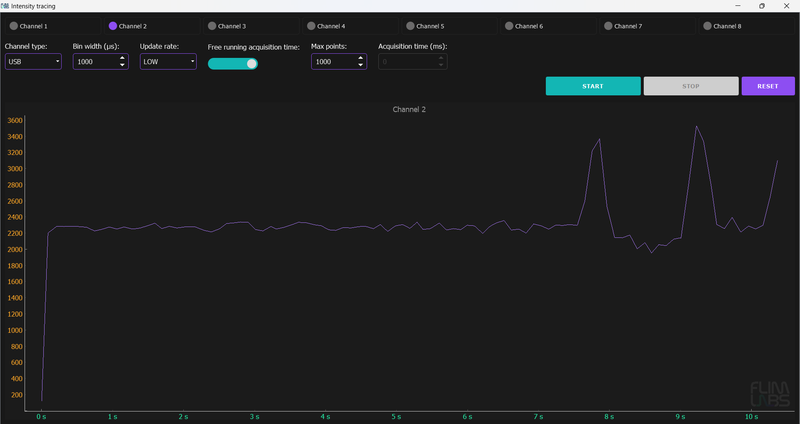

<a name="readme-top"></a>

<!-- PROJECT LOGO -->
<br />
<div align="center">
  <a href="https://www.flimlabs.com/">
    
  </a>
</div>


<!-- TABLE OF CONTENTS -->
<details>
  <summary>Table of Contents</summary>
  <ol>
    <li>
      <a href="#about-the-project">About The Project</a>
      <ul>
        <li><a href="#built-with">Built With</a></li>
      </ul>
    </li>
    <li>
      <a href="#getting-started">Getting Started</a>
      <ul>
        <li><a href="#prerequisites">Prerequisites</a></li>
        <li><a href="#installation">Installation</a></li>
      </ul>
    </li>
    <li><a href="#gui-usage">GUI Usage</a></li>
    <li><a href="#console-usage">Console Usage</a></li>
    <li><a href="#license">License</a></li>
    <li><a href="#contact">Contact</a></li>
  </ol>
</details>


<!-- ABOUT THE PROJECT -->
## About The Project

Welcome to [FLIM LABS Intensity Tracing](https://github.com/pontino/flim-python-examples), a Python application designed to quantify **photon intensity** within specified temporal detection windows. Facilitated by an underlying data processor developed in Rust, responsible for data retrieval from the hardware component, this application enables real-time data analysis and visualization. Users can seamlessly transition between the graphical user interface (**GUI**) and **console** mode to navigate through the analytical capabilities. Whether your focus is on rigorous data analysis or dynamic visualizations, Intensity Tracing serves as a flexible tool for the precise measurement and exploration of photon intensity.

<p align="right">(<a href="#readme-top">back to top</a>)</p>


### Built With

* [Python](https://www.python.org/)
* [PyQt5](https://pypi.org/project/PyQt5/)
* [pglive](https://pypi.org/project/pglive/)

<p align="right">(<a href="#readme-top">back to top</a>)</p>


<!-- GETTING STARTED -->
## Getting Started
To directly test the application, skipping the prerequisites and installation requirements you can download an installer at this [link](https://www.google.com).

To get a local copy up and running follow these steps.

### Prerequisites

To be able to run this project locally on your machine you need to satisfy these requirements:
* Possess a [FLIM LABS acquisition card](https://www.flimlabs.com/products/data-acquisition-card/) to be able to acquire your data
* The acquisition card requires a _Windows_ or _Linux_ OS
* ZestSC3 drivers installed
* Python version >= 3.8

### Installation

1. Clone the repo
   ```sh
   git clone https://github.com/pontino/flim-python-examples.git
   ```
2. Set the virtual environment in the root folder
   ```sh
   python -m venv venv
   ```
3. Install the dependencies
   ```sh
   pip install -r requirements.txt
   ```
4. Run the project with GUI mode
   ```sh
   python gui.py
   ```  
5. Or run the project with Console mode
   ```sh
   python console.py   
   ```   


<p align="right">(<a href="#readme-top">back to top</a>)</p>


<!-- USAGE EXAMPLES -->
## GUI Usage

<div align="center">
    
</div>


The GUI mode provides advanced functionality for configuring analysis **parameters** and displaying live-streamed photon data. It allows simultaneous acquisition from up to **8 channels**, offering real-time data visualization in the form of plots: 
* **X** Axis: represents _acquisition time_
* **Y** Axis: represents _photons intensity_

Here a table summary of the configurable parameters:


|                               | data-type   | config                                                                            | default | explanation                                                                                                                                                                                        |
|-------------------------------|-------------|-----------------------------------------------------------------------------------|---------------|----------------------------------------------------------------------------------------------------------------------------------------------------------------------------------------------------|
| ```enabled_channels```              | number[]    | set a list of enabled acquisition data channels (up to 8). e.g. [0,1,2,3,4,5,6,7] | []            | the list of enabled channels for photons data acquisition                                                                                                                                          |
| ```selected_conn_channel```            | string      | set the selected connection type for acquisition (USB or SMA)                     | "USB"         | If USB is selected, USB firmware is automatically used. If SMA is selected, SMA firmware is automatically used.                                                                                    |
| ```bin_width_micros```                 | number      | Set the numerical value in microseconds                                           | 1000 (ms)     | the time duration to wait for photons count accumulation.                                                                                                                                          |
| ```selected_update_rate```             | string      | Set the chart update frequency (**"LOW"** or **"HIGH"**)                          | "LOW"         | Based on the **selected_update_rate** value and the number of **enabled_channels** an algorithm determines the **draw_frequency** value assuring a balanced chart data visualization               |
| ```free_running_acquisition_time```    | boolean     | Set the acquisition time mode (**True** or **False**)                             | True          | If set to True, the _acquisition_time_millis_ is indeterminate, but _keep_points_ param needs to be specified. If set to False, the acquisition_time_millis param is needed (acquisition duration) |
| ```keep_points```                      | number      | Set how many charts points to keep on the screen                                  | 1000          | This option sets the upper limit for the number of points visible in the chart display,  aiming to prevent visual clutter and enhance readability                                                  |
| ```acquisition_time_millis```          | number/None | Set the data acquisition duration                                                 | None          | The acquisition duration is indeterminate (None) if _free_running_acquisition_time_ is set to True.                                                                                                |

<br/>

### `set_draw_frequency` function algorithm

The purpose of `set_draw_frequency` function is is to determine and set the charts drawing frequency based on certain conditions, taking into account the selected _update rate_ and the _number of enabled channels_.

* If the `selected_update_rate` is set to "LOW" the `draw_frequency` value will fall within a range between **5** and **20**, depending on the number of active channels.
* If the `selected_update_rate` is set to "HIGH" the `draw_frequency` value will fall within a range between **21** and **100**, depending on the number of active channels.

```python
def set_draw_frequency(self):
    num_enabled_channels = len(self.enabled_channels)

    # Set default draw frequency when no channels are enabled and update rate is not "LOW" or "HIGH"
    if self.selected_update_rate not in ["LOW", "HIGH"] and num_enabled_channels == 0:
        self.draw_frequency = 10
        return

    # Define minimum and maximum frequencies based on the selected update rate
    if self.selected_update_rate == "LOW":
        min_frequency = 5
        max_frequency = 20
    else:
        min_frequency = 21
        max_frequency = 100

    # Calculate the frequency range and step based on the number of enabled channels
    frequency_range = max_frequency - min_frequency
    step = frequency_range / num_enabled_channels

    # Adjust the frequency considering the number of enabled channels
    adjusted_frequency = max_frequency - step * (num_enabled_channels - 1)

    # Set the draw frequency within the specified range
    self.draw_frequency = max(min_frequency, min(max_frequency, adjusted_frequency))
``` 


<p align="right">(<a href="#readme-top">back to top</a>)</p>


## Console Usage

<div align="center">
    
</div>


The Console mode provides live-streaming data representation directly in the console, without an interface intermediary and charts data visualization processes.
The data displayed on the console screen indicates **the moment of acquisition** (in milliseconds) and the corresponding **number of photons** detected during that time.

Here a table summary of the configurable parameters on code side:


|                               | data-type   | config                                                                            | default | explanation                                                                                                                                                                                        |
|-------------------------------|-------------|-----------------------------------------------------------------------------------|---------------|----------------------------------------------------------------------------------------------------------------------------------------------------------------------------------------------------|
| ```enabled_channels```              | number[]    | set a list of enabled acquisition data channels (up to 8). e.g. [0,1,2,3,4,5,6,7] | [1]            | the list of enabled channels for photons data acquisition                                                                                                                                                                                                                           |
| ```bin_width_micros```                 | number      | Set the numerical value in microseconds                                           | 1000 (ms)     | the time duration to wait for photons count accumulation.                                                                                                                                          |
 ```acquisition_time_millis```          | number/None | Set the data acquisition duration                                                 | None          | The acquisition duration could be determinate (_numeric value_)    or indeterminate (_None_)                                             


## License

Distributed under the MIT License.

<p align="right">(<a href="#readme-top">back to top</a>)</p>


<!-- CONTACT -->
## Contact

FLIM LABS: info@flimlabs.com

Project Link: [FLIM LABS - Intensity Tracing](https://github.com/pontino/flim-python-examples)

<p align="right">(<a href="#readme-top">back to top</a>)</p>


